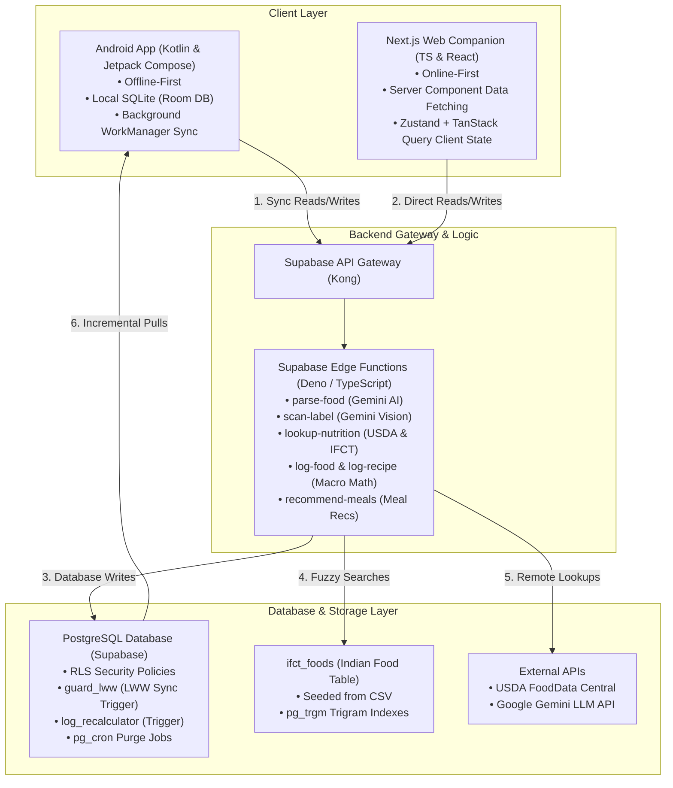
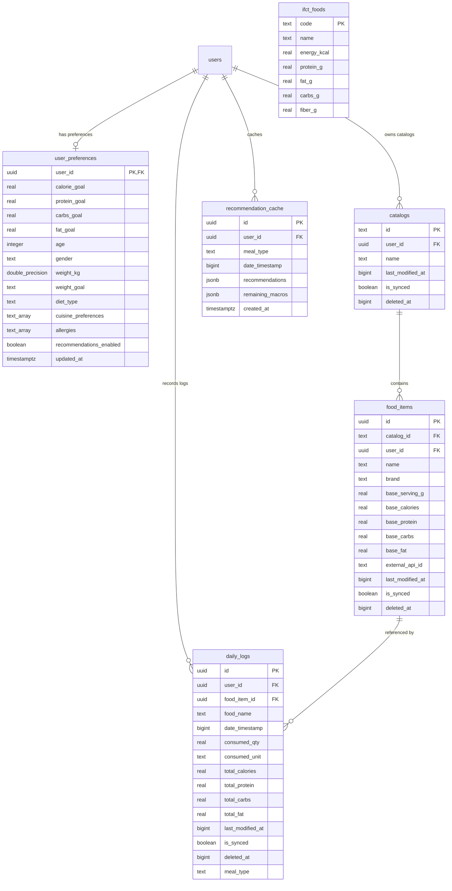

# NutriAI Platform — System Architecture & Design Document (HLD & LLD)

This document provides a comprehensive overview of the high-level and low-level architecture of the **NutriAI** platform, structured as a production-grade system design specification.

---

## 1. Executive Summary

NutriAI is an AI-powered, cross-platform nutrition tracking, recipe building, and dietary planning ecosystem. The platform consists of three core components:
1. **Android Application**: An offline-first, native client built using Kotlin, Jetpack Compose, Room SQLite, Hilt, and WorkManager.
2. **Web Companion Application**: An online-first companion client built using Next.js 14 (App Router), TypeScript, Zustand, and TanStack Query v5.
3. **Shared Supabase Backend**: A PostgreSQL database container featuring Row-Level Security (RLS), custom triggers, cron schedules, and centralized serverless **Supabase Edge Functions** (Deno/TypeScript) executing AI prompts and business rules.

To eliminate logic drift between the mobile and web interfaces, all writing operations (logging food, compounding recipes, scanning labels, and fetching recommendations) are centralized in serverless edge functions.

---

## 2. System Requirements

### 2.1 Functional Requirements (FRs)
- **FR1: Natural Language Food Logging (AI Parse)**: Users can enter food consumed in plain text (e.g., "3 eggs and a cup of oats"), and the system must parse this into structured food items, quantities, and units.
- **FR2: Nutrition Grounding (FDC & IFCT Lookup)**: The system must automatically resolve parsed food items against two databases: USDA FoodData Central (FDC) and the Indian Food Composition Tables (IFCT).
- **FR3: Custom Food and Recipe Catalogs**: Users must be able to create, edit, search, and delete custom ingredients and compound recipes (which consist of multiple ingredient items).
- **FR4: Daily Nutritional Diary**: Users can view, add, edit, and delete logged foods for any given day, displaying accumulated calories, proteins, carbohydrates, and fats.
- **FR5: Multimodal Nutrition Label Scanner**: Users can upload or snap a photo of a nutrition facts label, and the system must extract and scale the macronutrients.
- **FR6: Personalized Meal Recommendations**: The system must provide personalized meal recommendations based on the user's available catalog, remaining daily macros, time of day, and dietary profile (allergies, diet, age, weight).

### 2.2 Non-Functional Requirements (NFRs)
- **NFR1: High Availability & Low Latency**: The web app must load within 1.5 seconds. Non-AI API requests must resolve in less than 200ms.
- **NFR2: Offline Resilience (Android)**: The Android app must remain fully functional without internet access. Local writes (logging, editing, deleting) must be cached locally and synced to the cloud upon reconnection.
- **NFR3: Data Consistency (No Logic Drift)**: Nutritional calculations, unit conversions, and macro scaling must be identical across both Android and Web platforms.
- **NFR4: Conflict Resolution**: When offline updates from multiple devices conflict, the system must resolve them deterministically (Last-Write-Wins and Delete-Wins).
- **NFR5: Security & Privacy**: All user data must be strictly partitioned. No user can view, edit, or delete another user's food logs, catalogs, or preferences (enforced by Row-Level Security). API keys must never be exposed to client applications.

---

## 3. System APIs & Interfaces

All writing and heavy-computation endpoints are exposed as RESTful services through Supabase Edge Functions.

### 3.1 AI Food Parsing
`POST /functions/v1/parse-food`

- **Request Headers:**
  - `Authorization: Bearer <JWT>`
- **Request Body:**
```json
{
  "foodDescription": "2 boiled eggs and 1 cup oatmeal",
  "clarificationAnswers": {
    "question_id_1": "Whole Milk"
  }
}
```
- **Response Body (Success):**
```json
{
  "foods": [
    {
      "name": "boiled egg",
      "quantity": 2,
      "unit": "piece",
      "confidence": 0.98,
      "is_recipe": false,
      "ingredients": [],
      "catalogMatch": null
    },
    {
      "name": "oatmeal",
      "quantity": 1,
      "unit": "cup",
      "confidence": 0.95,
      "is_recipe": false,
      "ingredients": [],
      "catalogMatch": {
        "isFromCatalog": true,
        "foodItem": {
          "id": "7ca6414c-4c4f-40e9-9130-bb4bbf180f68",
          "name": "Oatmeal",
          "base_calories": 150.0,
          "base_protein": 5.0,
          "base_carbs": 27.0,
          "base_fat": 2.5,
          "base_serving_g": 240.0
        }
      }
    }
  ],
  "clarifications": []
}
```
- **Response Body (If clarification needed):**
```json
{
  "foods": [],
  "clarifications": [
    {
      "id": "question_id_2",
      "text": "What kind of milk did you use in the oatmeal?",
      "options": ["Whole Milk", "Skim Milk", "Almond Milk", "Water"]
    }
  ]
}
```

---

### 3.2 Nutrition Grounding Lookup
`POST /functions/v1/lookup-nutrition`

- **Request Body:**
```json
{
  "foodNames": ["boiled egg", "raw rice"]
}
```
- **Response Body:**
```json
{
  "results": [
    {
      "name": "boiled egg",
      "nutrition": {
        "caloriesPer100g": 155.0,
        "proteinPer100g": 13.0,
        "carbsPer100g": 1.1,
        "fatPer100g": 11.0,
        "servingWeightG": 50.0
      },
      "source": "USDA FDC"
    },
    {
      "name": "raw rice",
      "nutrition": {
        "caloriesPer100g": 345.0,
        "proteinPer100g": 7.9,
        "carbsPer100g": 78.2,
        "fatPer100g": 1.0
      },
      "source": "IFCT 2017"
    }
  ]
}
```

---

### 3.3 Log Food Item
`POST /functions/v1/log-food`

- **Request Body:**
```json
{
  "foodName": "boiled egg",
  "brand": null,
  "servingG": 50.0,
  "calories": 155.0,
  "protein": 13.0,
  "carbs": 1.1,
  "fat": 11.0,
  "quantity": 2.0,
  "unit": "serving",
  "dateTimestamp": 1781373600000,
  "catalogId": "user-uuid_local_user_ingredients",
  "externalApiId": "fdc-173424",
  "existingFoodItemId": null,
  "skipDailyLog": false
}
```
- **Response Body:**
```json
{
  "foodItemId": "52857416-8968-452f-a63e-dbff9f14371a"
}
```

---

### 3.4 Multimodal Nutrition Label Scanner
`POST /functions/v1/scan-label`

- **Request Body:**
```json
{
  "base64": "/9j/4AAQSkZJRgABAQEASABIAAD/...",
  "mimeType": "image/jpeg"
}
```
- **Response Body:**
```json
{
  "raw_calories_per_serving": 150.0,
  "raw_protein_g": 6.0,
  "raw_carbs_g": 20.0,
  "raw_fat_g": 4.5,
  "serving_size_text": "1 container",
  "serving_weight_g": 228.0,
  "calories": 65.78,
  "protein": 2.63,
  "carbs": 8.77,
  "fat": 1.97,
  "suggested_quantity": 228.0,
  "suggested_unit": "grams"
}
```

---

### 3.5 Fetch Meal Recommendations
`POST /functions/v1/recommend-meals`

- **Request Body:**
```json
{
  "mode": "time_based",
  "timeOfDay": "morning",
  "remainingMacros": {
    "calories": 620.0,
    "protein": 40.0,
    "carbs": 70.0,
    "fat": 20.0
  },
  "includeInternet": true
}
```
- **Response Body:**
```json
{
  "recommendations": [
    {
      "id": "7ca6414c-4c4f-40e9-9130-bb4bbf180f68",
      "name": "Oatmeal with Almond Milk",
      "source": "catalog",
      "estimatedMacros": {
        "calories": 280.0,
        "protein": 11.0,
        "carbs": 44.0,
        "fat": 6.5
      },
      "description": "A warm, high-fiber breakfast made with your catalog oatmeal.",
      "searchQuery": null
    },
    {
      "id": null,
      "name": "Spiced Tofu Scramble",
      "source": "internet",
      "estimatedMacros": {
        "calories": 310.0,
        "protein": 24.0,
        "carbs": 12.0,
        "fat": 18.0
      },
      "description": "High-protein plant-based scramble seasoned with turmeric and cumin.",
      "searchQuery": "healthy high protein tofu scramble recipe"
    }
  ]
}
```

---

## 4. High-Level Design (HLD)

The system architecture diagram showcases the separation of concerns:



### 4.1 Component Breakdown

#### A. API Gateway (Kong)
- **Role**: Entry point for all incoming client traffic.
- **Functionality**:
  - Handles SSL termination and route forwarding to Supabase REST services or Edge Functions.
  - Automatically verifies JWTs signed by Supabase Auth (GoTrue) and injects user context (`auth.uid()`) into the request header.

#### B. Serverless Logic Layer (Supabase Edge Functions)
- **Engine**: Deno V8 Runtime (TypeScript).
- **Functionality**:
  - Executes stateless, isolated operations.
  - Handles prompt composition and interactions with the Gemini API (using `gemma-4-26b-a4b-it` model parameters).
  - Performs multi-database lookups (external USDA REST calls + local PostgreSQL query joins).
  - Validates and scales ingredients to construct and log recipes.

#### C. Database Layer (Supabase PostgreSQL)
- **Engine**: PostgreSQL 15+.
- **Functionality**:
  - Acts as the persistent data store.
  - Enforces relational constraints (such as cascade deletes and null-state checks on deleted records).
  - Runs in-database calculations via PL/pgSQL triggers and procedures, offloading computational overhead from application servers.

#### D. External Integrations
- **USDA FoodData Central API**: Fetches nutrition facts for ingredients not found in the local catalog or IFCT table.
- **Google Gemini API**: Powers the natural language text parser (multimodal text-to-structured-JSON) and the label scanner (image-to-text OCR + extraction).

---

## 5. Low-Level Design (LLD)

### 5.1 Database Schemas & Relationships



### 5.2 Key Database Triggers & Stored Procedures

#### 1. Last-Write-Wins Guard (`guard_lww`)
Applied to `catalogs`, `food_items`, and `daily_logs`. Enforces a conflict-resolution model where newer edits overwrite older ones, regardless of when they sync.
```sql
CREATE OR REPLACE FUNCTION guard_lww()
RETURNS TRIGGER AS $$
BEGIN
    IF (OLD.last_modified_at IS NOT NULL AND NEW.last_modified_at < OLD.last_modified_at) THEN
        RETURN OLD;
    END IF;
    RETURN NEW;
END;
$$ LANGUAGE plpgsql;

CREATE TRIGGER trg_daily_logs_lww
    BEFORE UPDATE ON daily_logs
    FOR EACH ROW EXECUTE FUNCTION guard_lww();
```

#### 2. Auto-Recalculate Historical Logs on Food Update
When a user updates the base macros of a food in their catalog, all historical daily logs that reference this food must be updated immediately to maintain accuracy.
```sql
CREATE OR REPLACE FUNCTION recalculate_logs_on_food_update()
RETURNS TRIGGER AS $$
BEGIN
    IF OLD.base_calories != NEW.base_calories
       OR OLD.base_protein != NEW.base_protein
       OR OLD.base_carbs != NEW.base_carbs
       OR OLD.base_fat != NEW.base_fat THEN
        
        UPDATE daily_logs
        SET
            total_calories   = NEW.base_calories * consumed_qty,
            total_protein    = NEW.base_protein * consumed_qty,
            total_carbs      = NEW.base_carbs * consumed_qty,
            total_fat        = NEW.base_fat * consumed_qty,
            last_modified_at = EXTRACT(EPOCH FROM now()) * 1000
        WHERE food_item_id = NEW.id
          AND deleted_at IS NULL;
    END IF;
    RETURN NEW;
END;
$$ LANGUAGE plpgsql;

CREATE TRIGGER trg_food_items_recalculate
    AFTER UPDATE ON food_items
    FOR EACH ROW EXECUTE FUNCTION recalculate_logs_on_food_update();
```

---

### 5.3 Offline Caching & Synchronization Mechanics (Android)
- **Room SQLite Caching**: When a user logs a food offline on Android, a local insert is performed in the Room database. The record is flagged with `is_synced = 0`.
- **Sync Trigger**: Android's `SyncPushManager` listens for database changes using Room/SQLite triggers. Upon detecting a write, it schedules a background job using `WorkManager` with network constraints.
- **Pull Cursor**: Synchronization performs a delta-pull (incremental sync). The client queries the database for all records where the server's `updated_at` timestamp is greater than the last sync timestamp.
- **Tombstones**: When an item is deleted, it is not immediately removed. Instead, `deleted_at` is set to the current epoch time. The record remains as a "tombstone" for 15 days, allowing other offline clients to pull and process the deletion.

---

### 5.4 AI Multimodal Pipeline (Gemma 4 integration)
- **Image Compression**: High-resolution mobile photos are compressed client-side before upload to reduce payload sizes and prevent timeouts:
  - Max dimension: 1024px.
  - Export: JPEG at 80% quality.
- **Multimodal Prompting**: The compressed image is encoded as a base64 string and sent alongside a strict JSON extraction schema (defined in `_shared/prompts.ts`) to the Gemini Vision API.
- **Token Optimization**: To avoid 10-second Edge Function timeouts, the prompt injects only a minimal representation of the user's catalog (id, name, and per-100g macros) rather than full database rows. The list of injected items is capped at 15.

---

## 6. Caching Strategy & Technology Choices

In designing the system architecture, we evaluated the use of dedicated caching layers (e.g., Redis, Memcached) versus database-level and client-side caching.

```
+-------------------------------------------------------------+
| CLIENT LAYER                                                |
| - Zustand: Transient UI State (e.g., Active Date)           |
| - TanStack Query: 30-min SWR cache                          |
+-------------------------------------------------------------+
                              |
                     HTTPS REST Requests
                              |
                              v
+-------------------------------------------------------------+
| BACKEND GATEWAY & EDGE LOGIC                                |
| - Supabase Edge Functions                                   |
+-------------------------------------------------------------+
                              |
                     Direct DB Connection
                              |
                              v
+-------------------------------------------------------------+
| DATABASE LAYER (PostgreSQL)                                 |
| - recommendation_cache Table (JSONB format)                 |
| - pg_cron automatic eviction                                |
+-------------------------------------------------------------+
```

### 6.1 Why We Do NOT Use Redis / Memcached
1. **Infrastructure Simplicity & Cost**: Operating a Redis cluster adds significant operational overhead, increases deployment complexity, and introduces hosting costs. For a self-funded or early-stage consumer application, keeping the infrastructure lean is crucial.
2. **User Data Isolation**: Because all user data is strictly segmented by `user_id` (via RLS), there is very little shared, global data that benefits from a shared cache like Redis. A user's diet logs, preferences, and meal recommendations are only ever read by that specific user.
3. **Complex Invalidation**: Storing user-specific data in Redis creates cache invalidation challenges. Whenever a user logs a food, edits a goal, or updates a catalog item, the Redis cache must be invalidated. Doing this across multiple client types (offline-first mobile, online-first web) introduces race conditions.

### 6.2 Chosen Caching Alternatives

#### A. Client-Side SWR Caching (TanStack Query v5)
- **Usage**: Implemented on the Web client.
- **Strategy**: Cache queries (like daily logs and catalogs) with a `staleTime` of 30 minutes. 
- **Benefit**: If a user navigates between the Home, Insights, and Catalog pages, the webapp instantly loads data from memory without making duplicate network requests. Mutations automatically invalidate the cache, triggering a background refetch to keep data accurate.

#### B. Database-Level JSON Caching (`recommendation_cache` Table)
- **Usage**: Implemented in the database to cache computationally heavy, time-based meal recommendations.
- **Strategy**: When the `recommend-meals` or `prefetch-recommendations` Edge Function generates recommendations via Gemini, the structured JSON array is stored directly in the `recommendation_cache` table as a `JSONB` column, keyed by `(user_id, meal_type, date_timestamp)`.
- **In-Database Staleness Check**: If the user's remaining macros change by more than 10% compared to the cached `remaining_macros` snapshot, the cache is treated as stale, and new recommendations are generated.
- **Automatic Eviction**: To prevent the database from growing indefinitely, a `pg_cron` schedule runs every night at 3:00 AM to delete cache entries older than 2 days:
  ```sql
  DELETE FROM recommendation_cache 
  WHERE date_timestamp < (EXTRACT(EPOCH FROM now() - INTERVAL '2 days') * 1000);
  ```

---

## 7. Architectural Decisions, Rationales, and Trade-offs

This section outlines the key engineering decisions, the rationales behind them, and their trade-offs.

### 7.1 Relational Database (PostgreSQL/Supabase) vs. NoSQL
Choosing a relational model over NoSQL (like DynamoDB or Firestore) was a critical design decision:

- **The Cascade Update Problem**: In a NoSQL database, if a user updates the calories of a custom ingredient (e.g. changing "Oatmeal" from 150 kcal to 160 kcal per 100g), updating all past logs containing that food would require a full table scan and multi-document updates. In PostgreSQL, this is handled in a single transaction via an `AFTER UPDATE` trigger.
- **Sync Consistency**: Maintaining synchronization between an offline-first client (Room) and an online-first client (Web) requires strict transaction management. The database must verify that incoming changes do not conflict with newer server edits. This is easily achieved in SQL using a `guard_lww` trigger. Doing this in a NoSQL database would require complex, custom middleware logic.

### 7.2 Centralizing Logic in Edge Functions
Porting business logic (e.g., macro scaling formulas, unit conversions, and Gemini prompt templates) from client applications to serverless Deno Edge Functions addressed several challenges:

- **Consistency**: Eliminates "logic drift," where the mobile app and web app perform calculations differently (e.g., applying the wrong formula for gram-to-serving conversions).
- **Security**: The Gemini API key and USDA FDC API key are stored in Supabase Vault, ensuring they are never exposed to the client.
- **Performance**: Heavy database queries and API lookups are performed close to the database and external servers, reducing network round-trips for the client.

### 7.3 Hybrid Sync Model: Offline-First vs. Online-First
The decision to make the Android app offline-first and the Web app online-first was a trade-off between user experience and development velocity:

- **Mobile (Offline-First)**: Mobile users expect to be able to log their food even in low-connectivity environments (e.g., grocery stores, restaurants, or subways).
- **Web (Online-First)**: Web users typically have a stable internet connection. Implementing an offline-first architecture in the browser (using IndexedDB or RxDB) would have significantly increased complexity. By making the web app online-first, we were able to build a lightweight, fast, and easy-to-maintain companion client.

---

## 8. Scaling

As the platform expands to support a global, large-scale user base, several architectural modifications, trade-offs, and optimizations would be necessary to ensure system performance, minimize latency, and manage cost and complexity.

### 8.1 Database Scaling: Sharding and Partitioning
- **User-Based Partitioning**: Since all user transactions are isolated (users only query their own logs, catalogs, and preferences), the PostgreSQL database can be horizontally partitioned or sharded using the `user_id` (UUID) as the partition/sharding key.
  - **Trade-off**: This eliminates cross-shard joins, which is acceptable since there are no queries that join data across multiple users. However, managing migrations and schema updates across multiple database shards becomes more complex.
- **Read Replicas**: To reduce latency for the online-first web client, read replicas can be deployed in major geographic regions (e.g., US-East, EU-West, AP-East). 
  - **Trade-off**: This introduces replication lag. An offline-first client syncing changes might read stale data immediately after a write if the read is routed to a replica. To mitigate this, write operations and subsequent sync validations must always route to the primary instance (using a primary-writer, replica-reader setup).

### 8.2 Caching Layer Scaling
- **Distributed Caching (Redis/Memcached)**: While the current architecture avoids Redis to reduce cost and infrastructure complexity, a global-scale application would benefit from a distributed in-memory cache to store:
  - User session tokens.
  - Active-day food logs (since users primarily read/write to the current day's log).
  - Frequently accessed user preferences.
  - **Trade-off**: Introducing Redis introduces a cache invalidation challenge. Every offline sync push from the mobile client must invalidate the corresponding key in Redis to prevent the web app from displaying stale data.
- **Edge Caching for External APIs**: To prevent hitting rate limits and incurring heavy costs on external lookups (like the USDA FDC API and Gemini API), we can implement edge caching. Common food searches (e.g., "banana", "chicken breast") can be cached globally at the CDN or API Gateway level for 24+ hours.

### 8.3 Search and NLP Scaling
- **Offloading Fuzzy Search**: The current `pg_trgm` GIN index on the `ifct_foods` and `food_items` tables works well for small to medium datasets. For millions of users with large, custom catalogs, these GIN indexes will slow down write performance.
  - **Solution**: Offload catalog search to a dedicated search cluster like Elasticsearch or a managed service like Algolia. We can stream database changes (inserts/updates/deletes) to the search index using Change Data Capture (CDC) pipelines like Debezium and Apache Kafka.
- **Fuzzy Matching Cache**: Cache the results of common natural language food descriptions to prevent invoking the Gemini API for identical strings (e.g., "1 apple").

### 8.4 Reducing Complexity
To keep the system manageable at scale, several simplifications can be made:
- **Move to On-Device AI models**: Basic natural language parsing and OCR can be shifted to the client device using on-device models like Gemini Nano or Google ML Kit. This offloads compute costs from the serverless edge network to the user's device, improves response times, and supports offline functionality on mobile.
- **Simplify Sync Flow**: The current bidirectional sync requires complex conflict resolution on the server. A simpler "eventual consistency" or "read-through/write-through" queue could be implemented on the mobile client, where the client simply pushes a queue of raw action events (e.g., `ADD_LOG`, `DELETE_ITEM`) to a queue, and the server processes them sequentially.
- **Ingestion Endpoint Consolidation**: Combine the `log-food` and `log-recipe` Edge Functions into a single unified `log-item` ingestion endpoint, reducing the surface area of API maintenance.

---

*Document Version: 1.3.0*  
*Last Updated: June 13, 2026*
